# 🗺️ Roadmap NestJS — Từ Zero đến Junior

## Nền tảng cần có TRƯỚC khi học NestJS

> [!IMPORTANT]
> NestJS xây trên TypeScript + Node.js. Thiếu nền tảng này sẽ rất vất vả.

### 1. JavaScript / TypeScript
- Kiểu dữ liệu, biến, hàm, vòng lặp, điều kiện
- **ES6+**: arrow function, destructuring, spread/rest, template literal, optional chaining
- **Async**: Promise, async/await, callback
- **TypeScript**: type, interface, generic, enum, decorator, access modifier (`private`, `readonly`...)

### 2. Node.js cơ bản
- Cách Node.js chạy (event loop, single thread)
- Module system (import/export)
- `npm` / `yarn` / `pnpm` — quản lý package
- Biến môi trường (`process.env`)

### 3. HTTP & REST API
- Các method: GET, POST, PUT, PATCH, DELETE
- Status code: 200, 201, 204, 400, 401, 403, 404, 409, 500
- Request/Response: header, body, query, params
- JSON

### 4. SQL cơ bản
- SELECT, INSERT, UPDATE, DELETE
- JOIN, WHERE, ORDER BY, GROUP BY
- Quan hệ: 1-1, 1-N, N-N

### 5. Git
- `git add`, `commit`, `push`, `pull`, `branch`, `merge`
- Quy trình làm việc nhóm cơ bản (feature branch, pull request)

---

## Kiến thức NestJS cốt lõi (BẮT BUỘC)

### Tầng 1 — Kiến trúc & khái niệm nền

| Khái niệm | Cần biết |
|---|---|
| **Module** | `@Module()`, imports, exports, providers, controllers — đây là cách NestJS tổ chức code |
| **Controller** | `@Controller()`, `@Get()`, `@Post()`, `@Put()`, `@Delete()`, `@Param()`, `@Query()`, `@Body()` |
| **Provider / Service** | `@Injectable()`, Dependency Injection (DI) — hiểu tại sao NestJS tự tạo và truyền instance |
| **DTO** (Data Transfer Object) | Class mô tả shape dữ liệu đầu vào, kết hợp với validation |

> [!TIP]
> Cách dễ nhất để hiểu Module → Controller → Service: nghĩ nó như **folder → route handler → business logic**.

### Tầng 2 — Làm việc với Database

| Khái niệm | Cần biết |
|---|---|
| **TypeORM** hoặc **Prisma** | Chọn 1 trong 2 để học. TypeORM phổ biến hơn trong hệ sinh thái NestJS |
| **Entity** | Ánh xạ bảng SQL sang class TypeScript |
| **Repository pattern** | Truy vấn DB qua repository thay vì viết SQL thô |
| **Migration** | Tạo/thay đổi cấu trúc bảng theo version |
| **Relations** | `@OneToMany`, `@ManyToOne`, `@ManyToMany` — quan hệ giữa các bảng |

### Tầng 3 — Validation & Error Handling

| Khái niệm | Cần biết |
|---|---|
| **ValidationPipe** | Tự động validate body request dựa trên DTO |
| **class-validator** | `@IsEmail()`, `@IsString()`, `@MinLength()`, `@IsNotEmpty()`... |
| **class-transformer** | `@Transform()`, `@Exclude()`, `plainToInstance()` |
| **Exception filters** | `HttpException`, `NotFoundException`, `ConflictException`... |

### Tầng 4 — Authentication & Authorization

| Khái niệm | Cần biết |
|---|---|
| **JWT** | Cách hoạt động của JSON Web Token (access token, refresh token) |
| **Passport.js** | `@nestjs/passport`, strategy (Local, JWT) |
| **Guards** | `@UseGuards()`, `AuthGuard`, custom guard |
| **Decorators tùy chỉnh** | Ví dụ: `@CurrentUser()` để lấy user từ request |

### Tầng 5 — Các tính năng quan trọng khác

| Khái niệm | Cần biết |
|---|---|
| **Middleware** | Chạy trước route handler (logging, CORS...) |
| **Interceptors** | Transform response, logging, caching |
| **Pipes** | Transform/validate dữ liệu đầu vào (`ParseIntPipe`, `ValidationPipe`) |
| **Config** | `@nestjs/config`, `.env` file, `ConfigService` |

---

## Kỹ năng thực hành (RẤT QUAN TRỌNG khi phỏng vấn)

### Dự án mẫu nên tự làm

> [!TIP]
> Làm **1 dự án CRUD hoàn chỉnh** có giá trị hơn đọc 10 bài tutorial. Nhà tuyển dụng muốn thấy bạn biết ghép các mảnh lại với nhau.

Gợi ý dự án theo độ khó tăng dần:

```
📦 Dự án 1: Todo App (1-2 ngày)
├── CRUD cơ bản
├── Validation
└── Kết nối PostgreSQL qua TypeORM

📦 Dự án 2: Blog API (3-5 ngày)
├── User + Post + Comment (quan hệ 1-N)
├── Auth bằng JWT
├── Phân quyền (chỉ author mới sửa/xóa bài mình)
└── Pagination

📦 Dự án 3: Expense Tracker (1-2 tuần) ← giống project bạn đang làm!
├── Auth (JWT + Google OAuth)
├── CRUD chi tiêu theo user
├── Thống kê (group by category, theo tháng)
├── Upload ảnh (hóa đơn)
└── Swagger API docs
```

### Công cụ cần biết dùng

- **Postman** hoặc **Thunder Client** — test API
- **pgAdmin** hoặc **DBeaver** — xem database
- **Swagger** (`@nestjs/swagger`) — tự sinh API docs
- **Docker** cơ bản — chạy PostgreSQL trong container

---

## Checklist tự đánh giá — "Tôi đã sẵn sàng apply Junior chưa?"

- [ ] Tự tạo project NestJS từ đầu, cấu trúc module rõ ràng
- [ ] Viết CRUD API hoàn chỉnh cho ít nhất 2-3 entity có quan hệ
- [ ] Validate input bằng DTO + class-validator
- [ ] Implement JWT auth (đăng ký, đăng nhập, bảo vệ route)
- [ ] Dùng Guard để phân quyền (ít nhất: chỉ owner mới sửa/xóa)
- [ ] Kết nối PostgreSQL/MySQL qua TypeORM hoặc Prisma
- [ ] Xử lý lỗi đúng cách (trả đúng status code, message rõ ràng)
- [ ] Biết đọc log lỗi và debug
- [ ] Biết dùng Git, push code lên GitHub
- [ ] Có ít nhất 1 project hoàn chỉnh trên GitHub để show

---

## Lộ trình thời gian gợi ý

> [!NOTE]
> Thời gian tùy vào nền tảng hiện tại. Nếu đã biết JS/TS thì nhanh hơn nhiều.

```mermaid
gantt
    title Lộ trình học NestJS → Junior
    dateFormat  X
    axisFormat %s tuần

    section Nền tảng
    JS/TS + Node.js cơ bản        :a1, 0, 2w
    SQL + HTTP + REST              :a2, after a1, 1w

    section NestJS Core
    Module, Controller, Service    :b1, after a2, 1w
    TypeORM + Database             :b2, after b1, 1w
    Validation + Error handling    :b3, after b2, 1w
    JWT Auth + Guards              :b4, after b3, 1w

    section Thực hành
    Dự án CRUD đơn giản           :c1, after b2, 1w
    Dự án có Auth + quan hệ       :c2, after b4, 2w
    Polish + Deploy + GitHub       :c3, after c2, 1w
```



**Tổng: ~8-10 tuần** nếu học mỗi ngày 2-3 tiếng và đã có nền JS.

---

## Tài liệu tham khảo

| Nguồn | Link |
|---|---|
| NestJS Official Docs | https://docs.nestjs.com |
| TypeORM Docs | https://typeorm.io |
| class-validator | https://github.com/typestack/class-validator |
| JWT.io (hiểu JWT) | https://jwt.io |
